# backend-hackfest 


#### 1) Login:

  - Doctor can login with validate credentials
  - ***```end-point Link: http://groupd-load-balancer-680499434.us-east-1.elb.amazonaws.com/api-token-auth/```***
   
   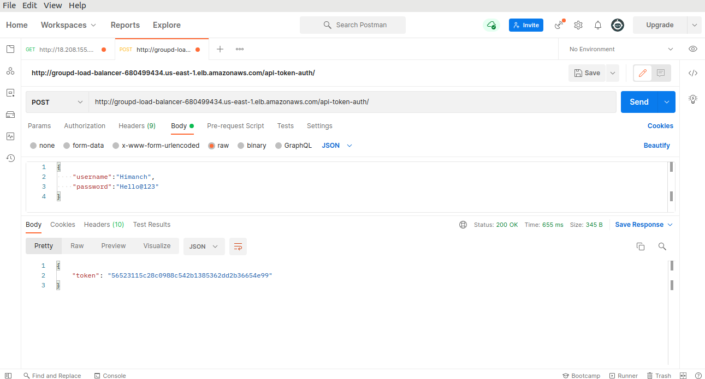
   
 #### 2) Registration:

   - Doctor can register with validate credentials
   - ***```end-point Link:http://groupd-load-balancer-680499434.us-east-1.elb.amazonaws.com/register```***
   - Method: POST
    
   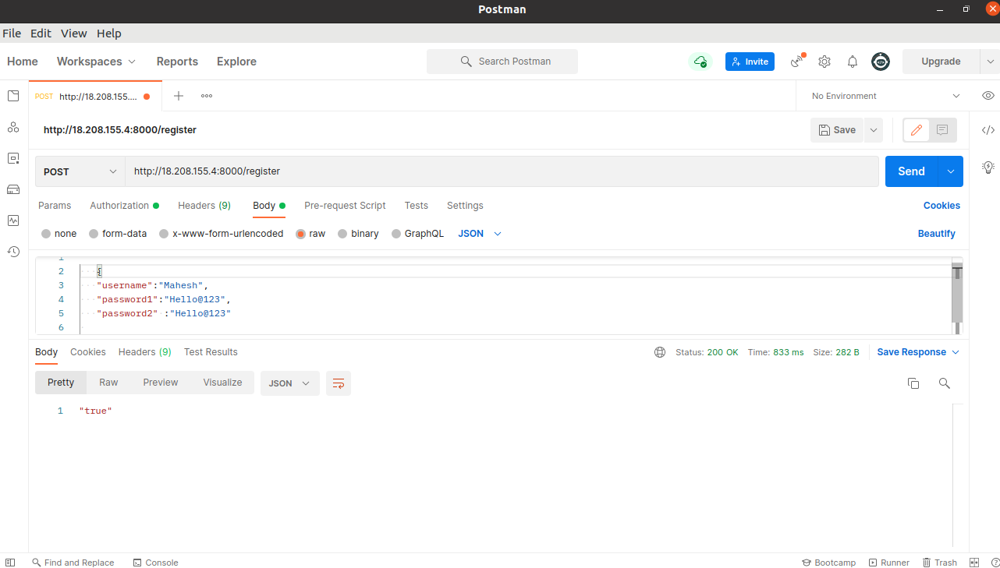

 
## PATIENT INFO APIS

#### 3) Patient Info:

   - Display all  patient information 
   - ***```end-point Link: http://groupd-load-balancer-680499434.us-east-1.elb.amazonaws.com/patientInfo```***
   - Method: GET

   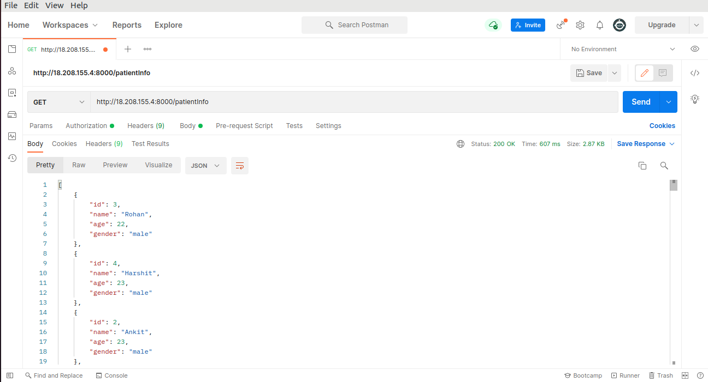
   
#### 4) add Patient details:
    - add patient details 
    
   - ***```end-point Link: http://groupd-load-balancer-680499434.us-east-1.elb.amazonaws.com/addPatientInfo```***
   - Method: POST
   
   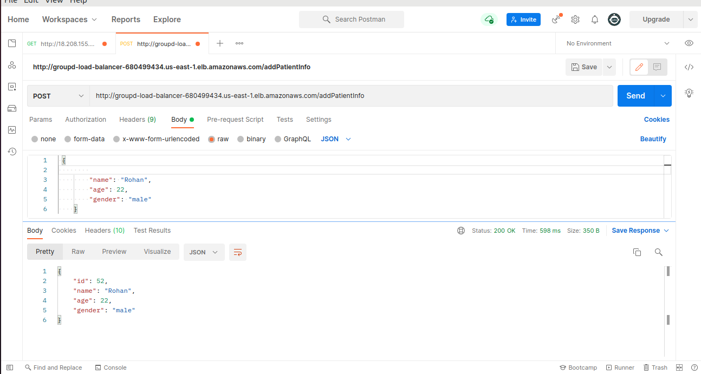
  
## MEDICAL SUMMARY APIS 
 
#### 5) Add Medical Summary:

   - Doctor can add patient medical summary 
   - Method:POST
   - ***```end-point Link: http://groupd-load-balancer-680499434.us-east-1.elb.amazonaws.com/addOneRecord/<int:pk>```***
   - <int:pk>: pass patient id here

   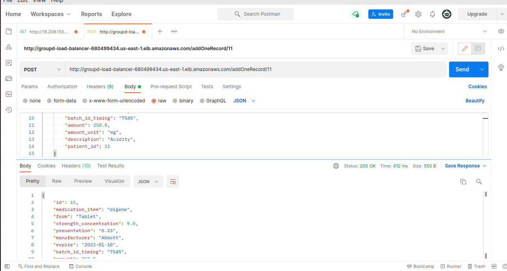
 
#### 6) Medical Summary:

   - See all Medical Records only for specific patient -
   - ***```end-point link: http://groupd-load-balancer-680499434.us-east-1.elb.amazonaws.com/medicalSummary/<int:fk>```***
   - Method: GET
   - Show all total medical records available in the database of us specific patient.
   - <int:fk>: pass your patient id here

   

#### 7) View one medical Summery of a patient:

   - Doctor can view one specific medical Summery of a patient
   - Method: GET
   - ***```end-point Link:http://groupd-load-balancer-680499434.us-east-1.elb.amazonaws.com/medicalOneSummary/int:pk>```***
   - <int:pk>: pass medical summary id here
 
   

## EPRESCRIPTION APIS 

#### 8) Add eprescription:

   - Doctor add prescription for the patient 
   - Method: POST
   - ***```end-point Link: http://groupd-load-balancer-680499434.us-east-1.elb.amazonaws.com/addOnePrescription/<int:fk>```***
   - <int:fk>: pass your patient id here

   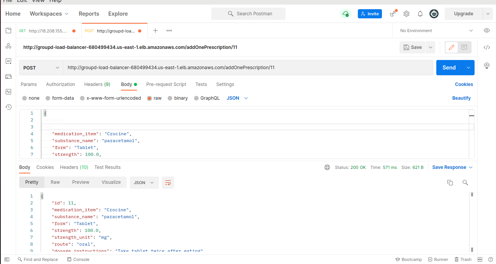


#### 9) View all prescription records of specific patient:

   - Doctor view all specific patient records
   - Method : GET
   - ***```end-point Link : http://groupd-load-balancer-680499434.us-east-1.elb.amazonaws.com/prescription/<int:fk>```***
   - <int:fk>: pass patient id here

   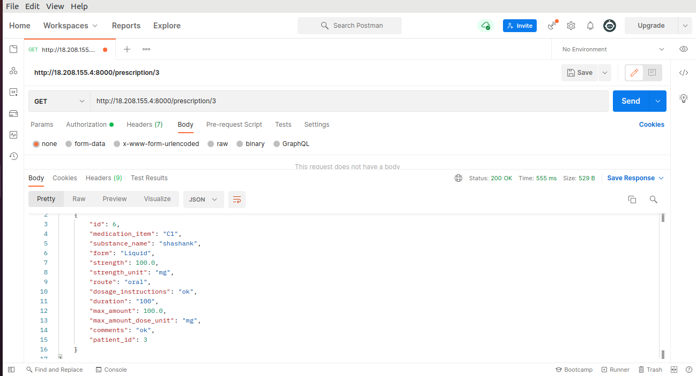


#### 10) View Specific prescription of patient:

   - Doctor can view specific prescription of patient
   - Method: GET
   - ***```end-point Link:  http://groupd-load-balancer-680499434.us-east-1.elb.amazonaws.com/onePrescription/int:pk>```***
   - <int:pk>: pass prescription id here

   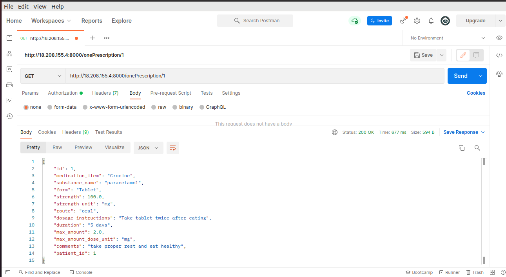

## DIAGNOSTIC RESULT APIS 

#### 11) Add diagnosis result:

   - Doctor can add diagnosis result of patient
   - Method: Post
   - ***```end-point Link: http://groupd-load-balancer-680499434.us-east-1.elb.amazonaws.com/addOneDignosticResult/<int:fk>```***
   - <int:fk>: pass patient id here

   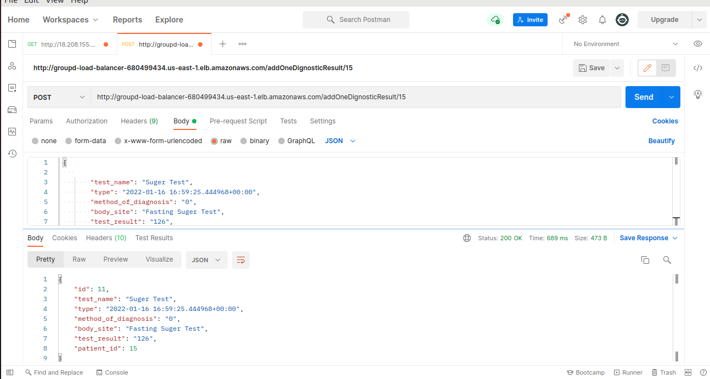

#### 12) View Diagnosis result of a specific patient:

   - Method: GET
   - ***```end-point Link: http://groupd-load-balancer-680499434.us-east-1.elb.amazonaws.com/diagnosticOneResult/<int:pk>```***
   - <int:fk>: pass Diagnosis id here
 
   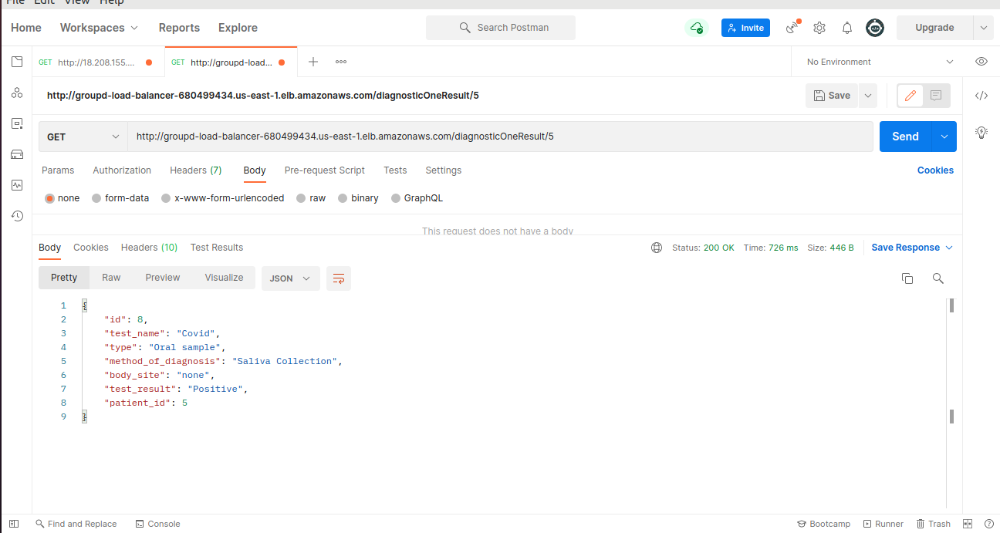
 
#### 13) View all Diagnosis result of a specific patient:
 
   - Doctor can view all diagnosis result of a patient
   - Method: GET
   - ***```end-point Link: http://groupd-load-balancer-680499434.us-east-1.elb.amazonaws.com/diagnosticResult/<int:pk>```***
 
   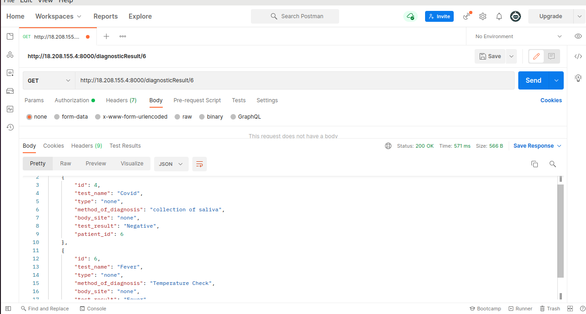
  

 ## PATIENT PLAN OF CARE APIS
 
#### 13) Add patient plan of care:

   - Doctor can add plan of care for the patient
   - Method: POST
   - ***```end-point link: http://groupd-load-balancer-680499434.us-east-1.elb.amazonaws.com/addOnePlanCare/int:fk>```***
   - <int:fk>: pass patient id 

   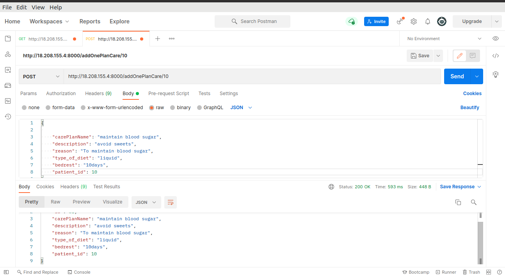

#### 14) View one plan of care specific record:

   - Doctor can view specific patient one plan of care record
   - Method: GET
   - ***```end-point Linhttp://groupd-load-balancer-680499434.us-east-1.elb.amazonaws.com/planOneCare/<int:pk>```***
   - <int:pk>: pass Plan Of Care id here 

   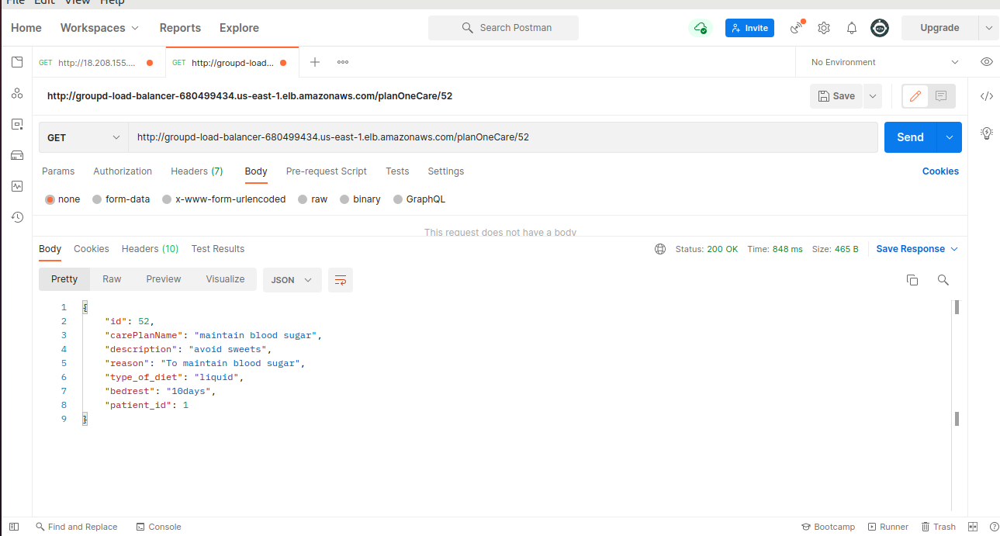
 
 #### 15) View all plane of care records of specific patient:
 
   - Doctor can view all plane of care records for specific patient 
   - Method: GET
   - ***```end-point Link:http://groupd-load-balancer-680499434.us-east-1.elb.amazonaws.com/planCare/<int:pk>```***
   - <int:pk>: pass patient id 

   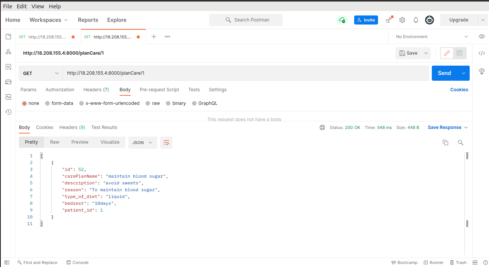


  
  
